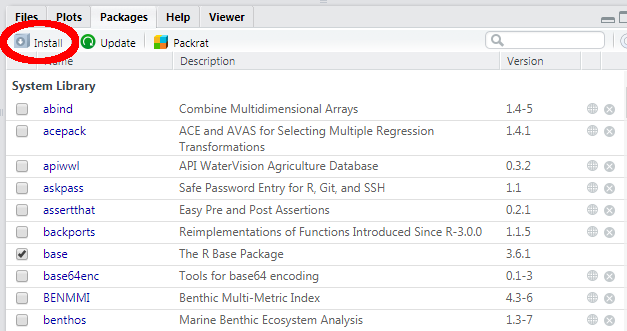
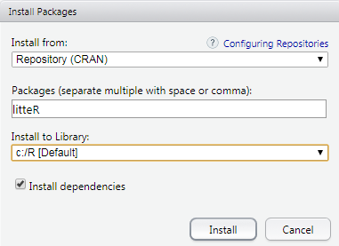
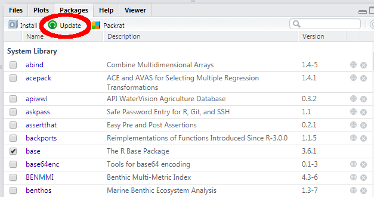

```{r setup, include = FALSE}
knitr::opts_chunk$set(
  collapse = TRUE,
  comment = "#>"
)
```


# Introduction

The **litteR**-package requires a _recent_ installation of the **R**-environment (`r R.Version()$version.string` or later). In addition, MS-Windows users also need to install **RStudio**, an integrated development environment (IDE) for **R**.

The aim of this manual is to help people with no, or only a limited experience with **R** and **RStudio** to

1. install the **R**-environment;
1. install **RStudio**;
1. install and update the **litteR**-package (and its dependencies).

Although this manual primarily focuses on MS-Windows users, users of other operating systems may also find these instructions useful.


# Installation of **R**

The latest version of **R** can be downloaded from the Comprehensive **R** Archive Network (CRAN) website as follows:

1. Navigate in a web-browser to https://cran.r-project.org;
1. Select the **R**-version for your operating system, _e.g._, `Download R for Windows`;
1. Select 'base';
1. Select `Download R x.y.z` (where x.y.z. is the version number, _e.g._, `r paste0(R.Version()$major, '.',  R.Version()$minor)`);
1. Double click on the downloaded file and follow the installation instructions on the screen. In case of doubt, simply select the default/recommended settings.


# Installation of **RStudio**

The latest version of **RStudio** can be downloaded from the [RStudio](https://rstudio.com) website: https://rstudio.com:

1. Click the download RStudio button;
1. Click the download RStudio Desktop button;
1. Click on the link 'RStudio x.y.z - Windows 10/8/7 (64-bit)' to download the MS-Windows version of RStudio (or click another link that matches your operating system). Again, x.y.z. is the version number;
1. Double click on the downloaded file and follow the installation instructions on the screen. In case of doubt, simply select the default/recommended settings.


# Installation of **litteR**

The easiest way to install **litteR** is by means of the package manager of **RStudio**. The package manager is located at the lower right panel of **RStudio**. The installation instructions are as follows:

1. click on the `Packages` tab in the lower right panel;
1. click on the `Install` button on the upper left of this tab (see figure below);

1. The `Install Packages dialogue` will appear (see below). Type **litteR** in the `Packages` text box (see below);

1. click the `Install` button. **RStudio** will now install **litteR** and all its dependencies.


# Updating **litteR**

We will occasionally publish new versions of **litteR** on CRAN. The easiest way to update **litteR** is by means of the package manager of **RStudio**. Simply click the `Update` button of the `Packages` tab and **RStudio** will update all outdated packages.




# Using **litteR**

For using **litteR** in your projects, please consult our [user manual](litter-manual.html).
