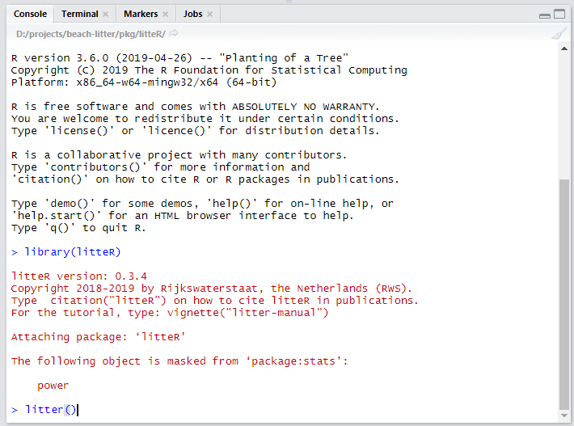
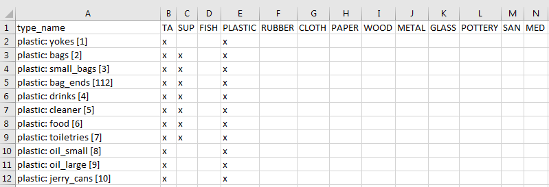
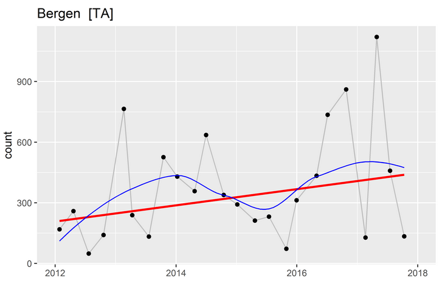
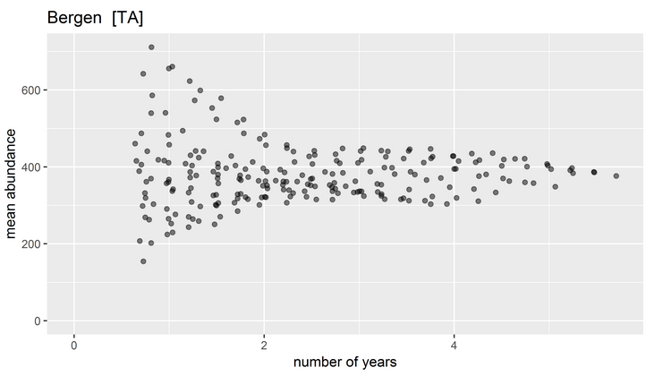
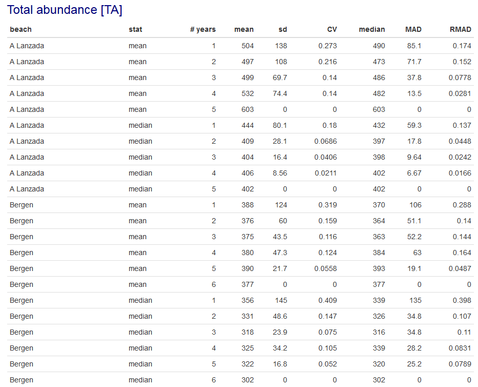
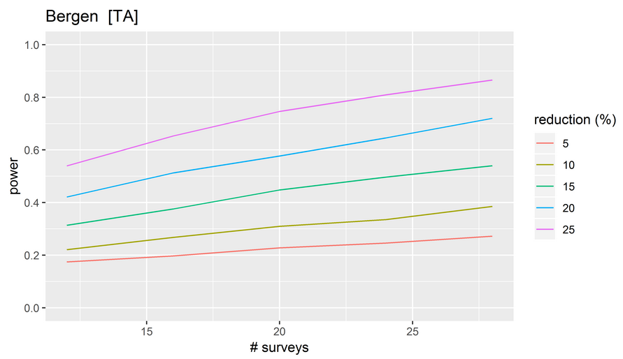

```{r setup, include = FALSE}
knitr::opts_chunk$set(
  collapse = TRUE,
  echo = FALSE,
  comment = "#>"
)
options(dplyr.width = Inf)
library(dplyr)
library(readr)
library(fs)
library(kableExtra)
```


# Introduction

`litteR` is a modular tool for analyzing litter data (_e.g._,  beach litter). The current version (`r packageVersion("litteR")`) contains the following modules:

- module stats: descriptive statistics;
- module_assessment: threshold assessment;
- module trend: non-parametric trend analysis of litter time-series;
- module baseline: baseline analysis and
- module power: power analysis.


One can optionally switch modules on or off. These modules run independently from each other.

This user guide consists of two parts. In the first part, the user interface is described, the second part gives more details on the modules.


`litteR` can be loaded by means of `library(litteR)`.

For applications with `litteR` see Schulz _et al._ (2019).


# User interface


## Create a new project

The easiest way to start working with `litteR` is to create an empty project directory. This directory can be filled with example and reference files by running:

`create_litter_project("d:/work/litter-projects/beach-litter")`


where its argument (the quoted part in parentheses) is an existing work directory on your computer. This can be any valid directory name with sufficient user privileges. Note for MS-Windows users: R requires forward slashes!

It is also possible to run `create_litter_project()` without an argument. In that case, a simple graphical user interface pops up for interactive directory selection.


## Perform litter analysis

`litteR` can be started typing `litter()` in the RStudio console (see the figure below).


```{r, out.width=650, fig.cap="Functions to start a litteR session.", fig.align="center"}

```


After entering `litter()` a simple graphical user interface pops up for file selection. An example of a file selection dialogue, in this case for selecting the input file, is given below.

```{r, out.width=650, fig.cap="File open dialogue.", fig.align="center"}
knitr::include_graphics("./fig/file-open-dialogue.png")
```


# Inputs

The file dialogues of `litteR` ask the user to specify:

- a settings file: where all settings / parameters are specified;
- a litter file: containing the litter data. These data can be beach litter data, or any other type of litter data;
- and an output directory, _.i.e._, the directory where the resulting HTML-report should be stored.

These files are briefly described below.


## Settings {#settings}

The settings file contains all settings needed to run `litteR`. The settings file is in the [YAML](https://en.wikipedia.org/wiki/YAML)-format. This is a human-readable data language that is commonly used for settings files. An example of the contents of a settings file is given in the figure below.
```{r, out.width="500px", fig.cap="Settings file in YAML-format.", fig.align='center', comment=NA}
path_package("litteR", "extdata", "settings.yaml") %>%
    read_lines %>%
    cat(sep = "\n")
```

The YAML-file contains the following entries:

```{r message=FALSE}
"./tbl/settings.csv" %>%
    read_csv(
        col_types = cols(
          entry = col_character(),
          description = col_character(),
          value = col_character()
        )) %>%
    kable %>%
    kable_styling(full_width = FALSE) %>%
    column_spec(2, width = "15em") %>%
    column_spec(3, width = "15em")
```


## Litter types

The current version of `litteR` reads litter data in three formats:

- the [OSPAR-format](https://odims.ospar.org) (wide data format), used for [beach litter](https://odims.ospar.org);
- a simpler [wide format](https://en.wikipedia.org/wiki/Wide_and_narrow_data)
- and a [long format](https://en.wikipedia.org/wiki/Wide_and_narrow_data)

These formats will be briefly described below.

### OSPAR format

The OSPAR format is a wide format, meaning that all litter types are stored in columns and each row represents a survey. 
OSPAR beach litter data can be downloaded from the [OSPAR website](https://odims.ospar.org).

The image below gives an example of the first 10 columns and records of litter data in the OSPAR-format. 

```{r, message=FALSE, comment=NA}
path_package("litteR", "extdata", "beach-litter-nl-2012-2017-ospar.csv") %>%
    read_csv %>%
    select(1:10) %>%
    slice(1:10)
```


The columns are separated by comma's (CSV-file). Five columns are compulsory, _i.e._, "refno", "beach name", "country", "region", and "survey date". Note that the date format does not comply with [ISO 6801](https://en.wikipedia.org/wiki/ISO_8601) standard date format. Instead, OSPAR uses dd/mm/YYYY (see the image above). The other columns contain litter types. The names of these columns have the following format

litter group: litter type [litter code]

for instance, 'Plastic: Bags [2]'.

Optionally, other columns may be added as metadata. However, these columns will be ignored by `litteR`.


### Wide format

The wide format is comparable to the OSPAR format, but less restrictive. The following columns are required: "region_name","country_code","country_name","location_name",and "date". The columns are separated by comma's (CSV-file)

The image below gives an example of the wide format. 

```{r, message=FALSE, comment=NA}
path_package("litteR", "extdata", "beach-litter-nl-2012-2017-wide.csv") %>%
    read_csv %>%
    select(1:8) %>%
    slice(1:10)
```


It's less restrictive than the OSPAR-format in the sense that litter types are not restricted to the format 

litter group : litter type [litter code]

The only requirement is that a [litter code] should be available. Indeed, all litter specifications given below are valid:

- "Plastic: spoon [56]"
- "Spoon [G56]"
- "Spoon [AB56]"
- "[56] spoon plastic"
- "Spoon plastic [56]"
- "Spoon [56] plastic"
- "Spoon [56]"

The first three specifications correspond to the [OSPAR](https://en.wikipedia.org/wiki/OSPAR_Convention)-code, the [TSG-ML](http://www.msfd.eu) general code (Technical Subgroup on Marine Litter), and the [UNEP](https://en.wikipedia.org/wiki/United_Nations_Environment_Programme)-code respectively.


### Long format

The long format is convenient for data analysis. The following columns are required:
"region_name", "country_code", "country_name", "location_name", "date", "type_name", and "abundance". The columns are separated by comma's (CSV-file)

The image below gives an example of the long format. It supports the same litter coding as the wide format.


```{r, message=FALSE, comment=NA}
path_package("litteR", "extdata", "beach-litter-nl-2012-2017-long.csv") %>%
    read_csv %>%
    slice(1:10)
```

### Quality Control

All input files are validated by `litteR`. The following validation rules apply:

1. all required columns (see above) should be available;
1. the date format should be valid, _i.e._ YYYY-mm-dd (ISO 8601) for the Wide and Long formats or dd/mm/YYYY for the OSPAR format;
1. litter names should adhere to the specifications given above;
1. abundances need to be [natural numbers](https://en.wikipedia.org/wiki/Natural_number) (ISO 80000-2);
1. all records should be unique, duplicated records will be removed with a warning;
1. all cells should be filled.


## Litter groups

The work directory should also contain a file called 'litter-groups.csv'. This file assigns each litter type (`type_name`, in rows) to one or more litter groups (columns). This file is automatically generated when using the `create_litter_project` function, described earlier in this tutorial. The first 11 rows of this file are given below.

```{r, out.width=650, fig.cap="First 10 records of the litter-groups.csv file.", fig.align="center"}

```


Both individual type codes and litter groups (column names) can be specified as `litter_type` in the [settings-file (*.yaml)](#settings). For instance:

`litter_type: [[TA], [49], [SUP], [FISH]]`


The user may optionally add new groups to or remove existing groups from this table. Only the `type_name` and `TA`-columns (total abundance) are compulsory.


# Output

## Report

`litteR` produces an HTML report that can best be viewed with modern web browsers like Mozilla FireFox, Google Chrome, or Safari. These browsers are freely available from the internet.

The filename of each report starts with 'litter-report', followed by 

- the litter types and/or groups that have been selected in the settings file
- a string of codes specifying the the selected modules
    - S: descriptive statistics
    - A: Threshold analysis
    - T: Trend analysis
    - B: Baseline analysis
    - P: Power analysis
- a timestamp: YYYYmmdd-HHMMSS

For example: `litter-report-[TA][49]-STABP-20190521-074547.html`

In the remainder of this section, each section of the HTML-report is briefly described.


### Settings

This section gives a summary of the settings/parameters in the settings file.


### Data Quality Control

In this section (potential) problems in the input files are reported.
    
    
### Descriptive statistics

For each selected litter type and period, this section gives several descriptive statistics. These statistics provide useful information about the data in a concise way. The following statistics are given:

-  mean abundance (mean):, _i.e._, [the arithmetic mean](https://en.wikipedia.org/wiki/Arithmetic_mean) of the counts for each litter type;
- median abundance (median), _i.e._, the [median](https://en.wikipedia.org/wiki/Median) of the counts for each litter type;
- relative abundance (rel.abund.): the contribution of each litter type to the total abundance of litter types (%);
- [coefficient of variation](https://en.wikipedia.org/wiki/Coefficient_of_variation) (CV): the ratio of the standard deviation to the mean of the counts for each litter type (%);
- ratio of the [MAD](https://en.wikipedia.org/wiki/Median_absolute_deviation) and the [median](https://en.wikipedia.org/wiki/Median) (RMAD, %);
- number of surveys (N).


These statistics will be estimated for the top x% types, _i.e._ types with the greatest abundances making up x% of the total abundance for each location.


### Threshold analysis

For each location, it is tested if the distribution of abundances is significantly lower than the supplied threshold value. Testing is performed by means of the one-tailed Wilcoxon signed rank test. In addition, the percentage of locations, with significantly low litter abundances at several spatial scales is given.


  

### Trend analysis

This section gives trend analysis results. The figures show time-series of litter items for each location, together with a monotonic trend line based on the [Theil-Sen](https://en.wikipedia.org/wiki/Theil%E2%80%93Sen_estimator) slope estimator. The Theil-Sen slope estimator is usually more robust than slopes estimated by [ordinary least squares](https://en.wikipedia.org/wiki/Ordinary_least_squares) regression. In addition, a [loess-smoother](https://en.wikipedia.org/wiki/Local_regression) is given to reveal potential non-linearities in the trend.

Finally, a table is provided showing the magnitude of the Theil-Sen slope estimator and its corresponding p-value. 

```{r, out.width=650, fig.cap="Example of a trend plot for total abundance (TA) at a beach near Bergen (The Netherlands). In this plot, the black dots are the observations, the thin gray line segments connect the dots and guide the eye, the blue line is a loess-smoother, and the red line is the Theil-Sen slope.", fig.align="center"}

```


### Baseline analysis

The aim of baseline analysis is to identify the minimum number of surveys needed to obtain stable baseline estimates.

This section provides figures showing the [moving average](https://en.wikipedia.org/wiki/Moving_average) as function of window size, _i.e._ the number of consecutive years, for each location.

The following procedure was followed to produce these plots:

1. Start with a window size of one year. One year usually corresponds to four surveys;
1. For each selected litter type, move the window over its time series. The step size is equal to one survey.
1. During each step, two statistics are computed for the survey data within the window:
    + the mean and median abundance;
    + the number of days spanned by the window, _i.e._ the window size. The window size will vary because the surveys are not equidistant in time;
1. increase the window size by one survey and repeat the procedure above until the maximum window size has been reached.


```{r, out.width=650, fig.cap="Example of a baseline plot. Each dot is the average abundance of a specific litter type or the total abundance (TA) within a moving window of the size given on the x-axis.", fig.align="center"}

```

In addition, also a table is presented giving for each location and number of years (# years) the mean, the standard deviation (sd), the coefficient of variation (CV), the median, the median absolute deviation (MAD), and the ratio of MAD to median of the baseline statistics (mean and median) plotted above.

```{r, out.width=700, fig.cap="Snapshot of the baseline table in the report. For an explanation, see main text.", fig.align="center"}

```


### Power analysis


In this section, the  power of the Wilcoxon signed rank test is estimated. The null hypothesis of this test is

H<sub>0</sub>: distribution of litter data is symmetric about the baseline value

and the alternative hypothesis is

H<sub>1</sub>: distribution of litter data is less than the baseline value

Hence, this is a test for a step trend. The [power](https://en.wikipedia.org/wiki/Power_(statistics)) of a hypothesis test is the probability that the test correctly rejects the null hypothesis (H<sub>0</sub>) when a specific alternative hypothesis (H<sub>1</sub>) is true. 

The power is useful to check if the number of surveys is sufficient. If the power is too low, sampling effort should be increased to be able to correctly detect trends. On the other hand, if the power is too high, sampling effort can be reduced. In both cases, power analysis may lead to more efficient allocation of financial resources.

In `litteR`, power analysis is carried out by means of Monte Carlo simulation for different values of the reduction (effect size), sample size and statistical significance. The procedure is as follows:


For each location, the time-series of the selected litter types are selected. For each of these time-series:

1. Estimate its mean abundance over the period of interest. This value is used as baseline value in the power analysis;
1. Multiply the abundances by a reduction factor _f_, where 0 < _f_ < 1 (effect size);
1. Draw _n_ (integer) values from the empirical cumulative distribution function (ECDF) of these reduced abundances;
1. Test if the simulated data are significantly below the baseline value by means of the Wilcoxon test;
1. Simulate a new data set and perform the test above many times (say, 1000 times);
1. Estimate the power as the average number of times the null-hypothesis is rejected (_i.e._, p < $\alpha$);
1. Repeat this procedure for different values for _n_, and _f_, given $\alpha$

The reduction factor _f_ scales the monitoring data. The following expression holds:

mean(simulated data) $\approx$ _f_ $\times$ mean(monitoring data) = _f_ $\times$ (baseline value)

Note that _f_ = 1 means no reduction (mean of the simulated data is approximately equal to the baseline value), and _f_ = 0 means absence of litter (for instance, a pristine clean beach).


```{r, out.width=650, fig.cap="Example of a power analysis plot. It gives the power (y-axis) as function of the number of surveys (x-axis) for different effect sizes (see legend).", fig.align="center"}

```


## Statistical summary

In addition to a report, a CSV-file with summary statistics will be produced for each location. This file is accompanied by a file with metadata. This file is given below:


```{r, message=FALSE, comment=NA}
path_package("litteR", "extdata", "litter-stats-meta.csv") %>%
    read_csv %>% 
    kable(align = "lll")
```


# References

Schulz, Marcus, Dennis J.J. Walvoort, Jon Barry, David M. Fleet, Willem M.G.M. van Loon, 2019. Baseline and power analyses for the assessment of beach litter reductions in the European OSPAR region. _Environmental Pollution_ 248:555-564. https://doi.org/10.1016/j.envpol.2019.02.030