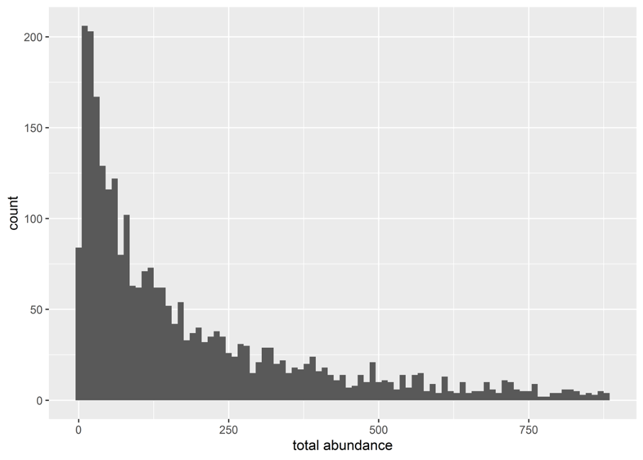
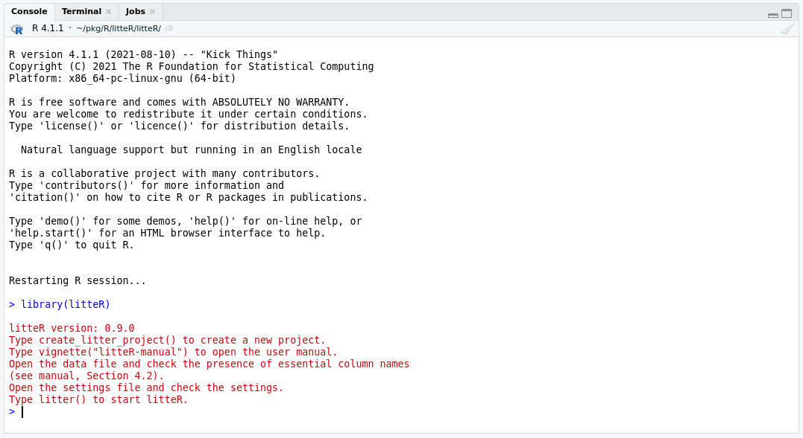
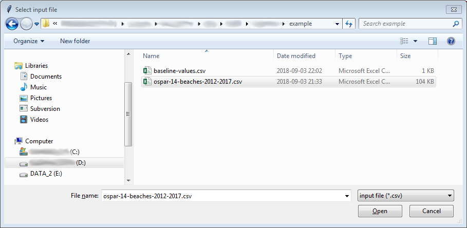
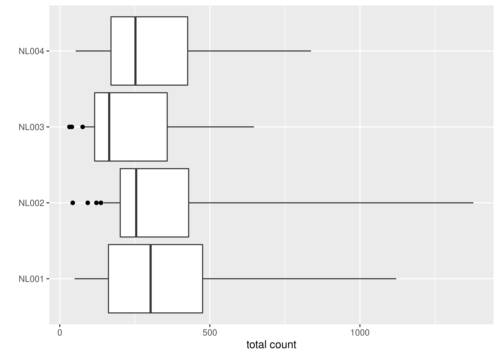
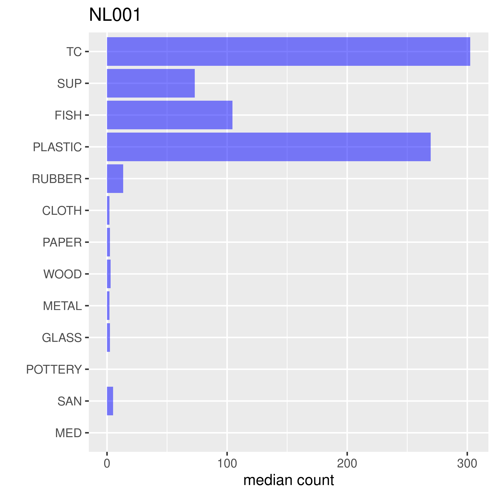
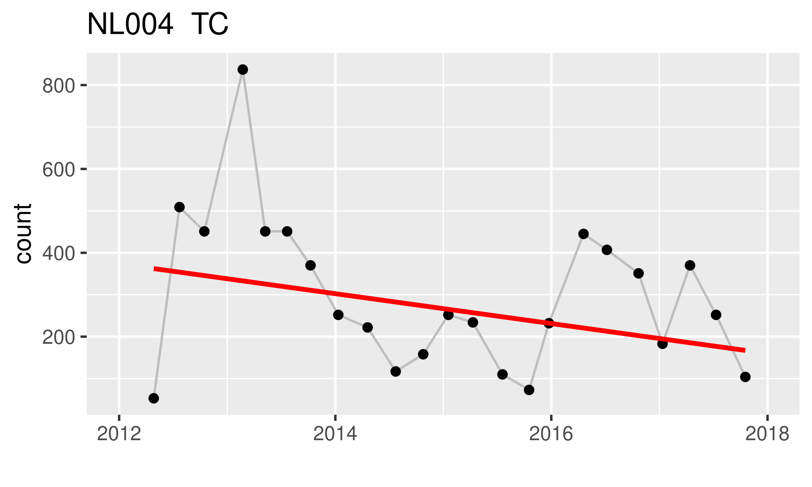
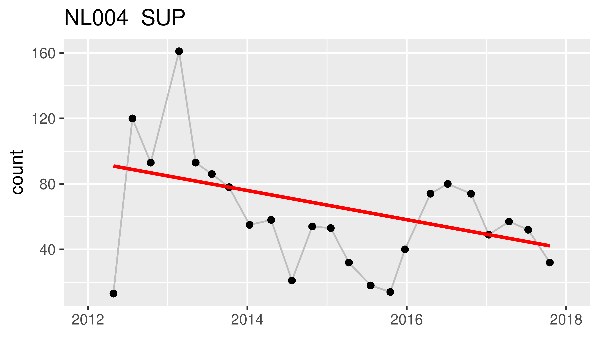
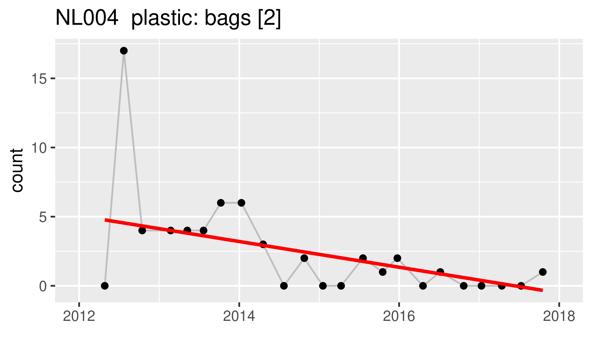

```{r setup, include = FALSE}
knitr::opts_chunk$set(
  collapse = TRUE,
  echo = FALSE,
  comment = "#>"
)
options(knitr.kable.NA = "",  dplyr.width = Inf)
library(dplyr)
library(readr)
library(fs)
library(kableExtra)
```


```{r, out.width=650, fig.align="center"}
knitr::include_graphics("./fig/beach-litter-cover-photo.jpg")
```


<br>
<br>
<br>

# Introduction

**litteR** is a user-friendly tool for analyzing litter data (_e.g._,  beach litter data). The current version (`r packageVersion("litteR")`) contains routines for:

- data quality control
- outlier analysis
- descriptive statistics, and
- trend analysis

The focus of this version of **litteR** is to provide a a user-friendly, flexible, robust, transparent, and relatively simple tool for litter analysis. Although **litteR** is distributed as an [R](https://www.r-project.org)-package, experience with R is not required. If you need more information on how to install R, RStudio, and **litteR**, please consult our [installation guide](litteR-installation.html).

Litter data are [count data](https://en.wikipedia.org/wiki/Count_data). As has been illustrated in the histogram below (copied with permission from Hanke _et al._, 2019), litter data generally have [skewed](https://en.wikipedia.org/wiki/Skewness) distributions. 
All procedures in **litteR** are basesd on robust statistical methods. They do not require distributional assumptions and are relatively robust for outliers.


```{r, out.width=450, fig.align="center"}

```


This user guide consists of two parts. In the first part, the user interface is described, the second part provides details on the technicalities.

For applications with (a previous version of) **litteR** see Schulz _et al._ (2019). **litter** is the successor of the Litter Analyst software (Schulz _et al._, 2017).

<br>
<br>
<br>

# Loading the **litteR**-package

Before **litteR** can be used, it should be installed or updated in case you installed **litteR** before. See our [installation guide](litteR-installation.html) fore details.


You need to _install_ **litteR** only once, but you need to _load_ this package each time you start RStudio.

The **litteR**-package should be loaded in RStudio before you can use it. This can be done by running the following code in the **R**-console or the [RStudio](https://rstudio.com)-console: 

`library(litteR)`

A startup messsage appears that gives some essential instructions to start using **litteR**.

<br>
<br>
<br>


# User interface


## Create a new project {#create_new_project}

The easiest way to start working with **litteR** is to create an empty project directory. This directory can be filled with example and reference files by running:

`create_litter_project("d:/work/litter-projects/beach-litter")`

in the [RStudio](https://rstudio.com)-console. For more information on how to obtain and use RStudio, consult its [website](https://rstudio.com) or read our [installation guide](litteR-installation.html).

The argument of function `create_litter_project` (_i.e._, the quoted part in parentheses) is an existing work directory on your computer. This can be any valid directory name with sufficient user privileges. Note for MS-Windows users: R requires forward slashes!

It is also possible to run `create_litter_project()` without an argument. In that case, a simple graphical user interface pops up for interactive directory selection.


## Perform litter analysis

**litteR** can be started typing `litter()` in the [RStudio](https://rstudio.com) console (see the figure below).

<br>


```{r, out.width=650, fig.align="center"}

```

<br>

After entering `litter()`, a simple graphical user interface pops up for file selection. An example of a file selection dialogue is given below.

<br>

```{r, out.width=650, fig.align="center"}

```


<br>
<br>
<br>


# Input

**litteR** needs three input files:

1. a type file, which contains all litter types and litter groups that are allowed to use;
1. a data file, which contains litter counts for each monitoring event.
1. a settings file, which contains all settings needed to perform a **litteR** run;

These input files are described below.


## Type file {#type_file}


The type file contains a list of all litter types that are allowed to use in the [data file](#data_file). It also indicates to which litter group each litter type belongs. Two example files, named '`types-ospar.csv`' and '`types-ospar-tc-sup-fish-plastic.csv`' are automatically generated when using the `create_litter_project`-function, a described [earlier](#create_new_project) in this tutorial. A type file assigns each litter type (`type_name`) to one or more litter groups. The first 10 rows of '`types-ospar-tc-sup-fish-plastic.csv` are given in the table below.

```{r, message=FALSE, comment=NA}
path_package("litteR", "extdata", "types-ospar-tc-sup-fish-plastic.csv") %>%
    read_csv %>%
    slice(1:10) %>%
    kable(align = c("l", "r", "c", "c", "c", "c"))
```

The following columns are in this table:

- `type_name`. This column is required and gives all litter types that are allowed in the data file. Litter types given in this column need to be unique;
- `included`: This column indicates whether a type specified in column `type_name` will be used in the analysis or not. Only `type_names` that are included in the analysis will contribute to the total litter count (TC).
- `SUP`, `FISH`, `PLASTIC`, etc.: these columns give the definition of each litter group. In the example above three groups are given: 'single use plastics' (SUP), 'fisheries related litter' (FISH), and 'plastics' (PLASTIC). A cross (x) indicates that a litter type in `type_name` is a member of a litter group or not. A cross (x) means 'a member', an empty cell means 'not a member'.

The user may use one of the provided type files as a template for his own type file. **litteR** will use the type file that has been specified in the [settings-file](#settings_file).


## Data file {#data_file}

**litteR** supports a simple and flexible data format. It is similar to the [OSPAR-format](https://odims.ospar.org). The data are stored in so called [wide format](https://en.wikipedia.org/wiki/Wide_and_narrow_data): each row refers to a single survey, each column to a single litter type or metadata. The table below gives an example of (a small) part of a data file.

```{r, message=FALSE, comment=NA}
path_package("litteR", "extdata", "beach-litter-nl-2012-2017.csv") %>%
    read_csv %>%
    select(spatial_code, date, country_code, `Plastic: Bags [2]`, `Plastic: Small_bags [3]`) %>%
    slice(1:10) %>%
    kable
```

The columns `spatial_code` and `date` are required. The remaning codes are either litter types or optional metadata. Each litter type should also be available in the [litter type file](#type_file). Only litter types in the [litter type file](#type_file) are valid. Column names that are neither valid litter types nor `spatial_code` or `date` are considered as optional metadata columns. These columns do not affect the results. In the example above, country codes have been added as metadata.

The column `spatial_code` gives the spatial aggregation level. All analysis results will be presented on this spatial aggregation level. In the example above, the spatial aggregation level is the beach where the litter surveys took place. However, higher spatial aggregation levels such as the country level, or regional levels can also be used. The `date` column gives the monitoring date in [ISO](https://en.wikipedia.org/wiki/ISO_8601) format, _i.e._, YYYY-mm-dd (for example `r Sys.Date()`, to indicate `r format(Sys.Date(), "%e %B %Y")`). For convenience, also the OSPAR-format (dd/mm/YYYY) is currently supported (for example `r format(Sys.Date(), "%d/%m/%Y")`, to indicate `r format(Sys.Date(), "%e %B %Y")`).

The third column `country_code`, in the type file given above, is not required and will not be used in the analysis. The remaining columns `Plastic: Bags [2]`, `Plastic: Small_bags [3]`, etc. contain the counts for each litter type that are selected in the [litter type file](#type_file).


## Settings file {#settings_file}

The settings file contains all settings needed to run **litteR**. An example of the contents of a settings file is given in the figure below.

```{r, out.width="500px", fig.cap="Settings file in YAML-format.", fig.align='center', comment=NA}
path_package("litteR", "extdata", "settings.yaml") %>%
    read_lines %>%
    cat(sep = "\n")
```

The settings-file contains the following entries:

- `date_min` and `date_max`, the first and final date of the period to analyze. Dates should be given in [ISO](https://en.wikipedia.org/wiki/ISO_8601) format, _i.e._, YYYY-mm-dd (for example `r Sys.Date()`, to indicate `r format(Sys.Date(), "%e %B %Y")`);
- `percentage_total_count`: the percentage of the total count used to estimate statistics. See the section on [descriptive statistics](#descriptive_statistics) for more information;
- `file_data`: name of the [data file](#data_file) (including its path, _e.g._, c:/my-litter-directory/my-litter-data.csv);
- `file_types`: name of the [type file](#type_file) (including its path, _e.g._, c:/my-litter-directory/types-ospar.csv);
- `spatial_code`: name(s) of location(s) to plot. Spatial codes should be available in column `spatial_code` in the [data file](#data_file);
- `group_code`: name(s) of group(s) to plot. Litter groups should be available as column names in the [type file](#type_file);
- `type_name`: name(s) of type(s) to plot; Type names should be available in the [type file](#type_file) and [data file](#data_file);
- `figure_quality`: quality of the plots in the report, either `high` or `low`.


## Data Quality Control

All input files are validated by **litteR**. The following validation rules apply:

1. all required columns (see above) should be available;
1. the date format should be valid, _i.e._ preferably YYYY-mm-dd ([ISO](https://en.wikipedia.org/wiki/ISO_8601)). For convenience, the OSPAR-date format (dd/mm/YYYY) is currently also supported;
1. litter type names should be specified in the [type file](#type_file);
1. litter counts in the [data file](#data_file) are [natural numbers](https://en.wikipedia.org/wiki/Natural_number) (ISO 80000-2). However, in some cases data files contain [real numbers](https://en.wikipedia.org/wiki/Real_number) due to preprocessing. Think about normalizing survey lengths to a common length. Although **litteR** prefers natural numbers, real numbers are also allowed for convenience. In case non-natural numbers are found, **litteR** will give a warning but will continue the analysis.;
1. all records should be unique, duplicated records will be removed with a warning;
1. all cells should be filled with the appropriate data type (numbers, text or dates).
1. the data file should be a comma-separated values file (CSV), _i.e._, a text file where the columns are separated by commas (,) and not by spaces, semicolons (;) or tabs.


# Output

**litteR** produces three output files:

1. a report, containing all analysis results
1. a CSV-file, containing all beach litter statistics
1. a log-file, containing all log data.

For convenience, all input and output files are stored as a snapshot in a directory with names like `litteR-results-20200602T141829`, where the final part of the name is a [timestamp](https://en.wikipedia.org/wiki/Timestamp).


## Report

**litteR** produces an HTML-report that can best be viewed with modern web browsers like Mozilla FireFox, Google Chrome, or Safari. These browsers are freely available from the internet.

The filename of each report starts with 'litter-results', followed by a timestamp: YYYYmmddTHHMMSS and the extension html. For example: `litteR-results-20200602T141829.html`

This section briefly describes each section in the HTML-report


### Settings

This section gives a summary of the settings in the [settings file](#settings_file).


### Data Quality Control

In this section (potential) problems in the input files are reported. These problems are also stored in the [log file](#log_file).


### Outlier analysis

For each `spatial_code` in the [data file](#data_file), [adjusted boxplots](https://dx.doi.org/doi:10.1016/j.csda.2007.11.008) are given of the total count for the detection of [outliers](https://en.wikipedia.org/wiki/Outlier). Outliers are given as dots (if any) in adjusted box-and-whisker plots. [Adjusted boxplots](https://dx.doi.org/doi:10.1016/j.csda.2007.11.008) are more suitable for outlier detection in case of skewed distributions than traditional box plots. An example of these box-and-whisker plots are given below.

```{r, out.width=650, fig.align="center"}

```


    
### Descriptive statistics {#descriptive_statistics}


For each `spatial_code` and group/type name, the following statistics are estimated:

- mean count, _i.e._, [the arithmetic mean](https://en.wikipedia.org/wiki/Arithmetic_mean) of the counts for each litter type;
- median count, _i.e._, the [median](https://en.wikipedia.org/wiki/Median) of the counts for each litter type;
- relative count: the contribution of each litter type to the total count of litter types (%);
- [coefficient of variation](https://en.wikipedia.org/wiki/Coefficient_of_variation) (CV): the ratio of the standard deviation to the mean of the counts for each litter type (%);
- ratio of [MAD](https://en.wikipedia.org/wiki/Median_absolute_deviation) and [median](https://en.wikipedia.org/wiki/Median) (RMAD, %);
- number of surveys;
- [Theil-Sen slope](https://en.wikipedia.org/wiki/Theil%E2%80%93Sen_estimator) (slope): a robust non-parametric estimator of slope (litter counts / year);
- [p-value](https://en.wikipedia.org/wiki/P-value): the p-value associated with the one-tailed [Mann-Kendall test](https://en.wikipedia.org/wiki/Kendall_rank_correlation_coefficient) to test the null hypothesis of 
    - no monotonically _increasing_ trend in case the Theil-Sen slope is greater than zero;
    - no monotonically _decreasing_ trend in case the Theil-Sen slope is smaller than zero;

These statistics will be estimated for all litter types with the greatest counts making up a percentage of the total count and for all litter groups. This percentage is given as `percentage_total_count` in the [settings file](#settings_file).

The descriptive statistics for the litter types and groups are stored in a CSV-file with a name starting with `litteR-results` and ending with a [timestamp](https://en.wikipedia.org/wiki/Timestamp). The statistics for litter groups are also printed as a table and shown as bar plots in the report: one plot for each spatial aggregation level as defined in the `spatial_code` [column of the data file](#data_file). An example is given in the figure below. If you want other groups, or only a subset of groups, you should modify the [type file](#type_file)

<br>

```{r, out.width=450, fig.align="center"}

```


### Trend analysis

For each spatial code, and the type names and group codes specified in the [settings file](#settings_file), trends are estimated by means of the [Theil-Sen slope estimator](https://en.wikipedia.org/wiki/Theil%E2%80%93Sen_estimator): a robust non-parametric estimator of slope (counts / year). The significance of the estimated slopes is tested by means of the [Mann-Kendall test](https://en.wikipedia.org/wiki/Kendall_rank_correlation_coefficient). The Mann-Kendall test is a non-parametric test and as such does not make distributional assumptions on the data. 

The figure below gives examples of trend plots for total count (TC), single use plastics (SUP), and plastic bags at the beach of Terschelling (The Netherlands). In each plot, the black dots are the observations, the thin gray line segments connect the dots and guide the eye, and the red line is the Theil-Sen slope.

<br>

```{r, out.width=600, fig.align="center"}

```

```{r, out.width=600, fig.align="center"}

```

```{r, out.width=600, fig.align="center"}

```


<br>


## Statistical summary file

In addition to a report, a CSV-file with descriptive statistics for each spatial code is produced. An example of such a table is given below. See Section [descriptive statistics](#descriptive_statistics) for more details. 

```{r, message=FALSE, comment=NA}
path("tab", "litteR-results-20200602T141829.csv") %>%
    read_csv %>%
    slice(1:10) %>%
    kable()
```


<br>


## Log-file {#log_file}

litteR's log-file is very helpful to understand warnings and error messages. The log-file stores the description of all data analysis steps in chronological order. Part of a log-file is given below.

<br>

```{r, message=FALSE, comment=NA}
path("tab", "litteR-log-20200602T141829.log") %>%
    read_lines %>%
    head(20) %>%
    paste0(collapse = "\n") %>%
    cat("\n")
```

<br>

Each line contains a single log-event and always has the following format:

1. timestamp;
2. type of log event: `INFO` for informative messages, `WARN` for warnings, `ERROR` for errors;
3. a log message.

<br>


# Troubleshooting

The runtime error messages and the log file should provide you with clear information about errors in the data file and settings, and about warnings (points of attention). For additional information you can consult the points below.


- Dates should comply with the [ISO date format](https://en.wikipedia.org/wiki/ISO_8601), _i.e._ YYYY-mm-dd (_e.g._, 2019-09-30) or the OSPAR data format (dd/mm/YYY). If you prepare your input data with MS-Excel, make sure that the dates in the exported CSV-file also comply with one of these formats. You can easily check this with a text editor (like Notepad on MS-Windows);
- After typing `litter()` in the RStudio-console, a file dialogue should appear. If that is not the case, the file dialogue is probably covered by RStudio (see the task manager or use ALT-TAB on MS-Windows to navigate to the hidden file dialogue);
- **litteR** expects a period (.) as decimal separator (_e.g._, 8.5) and _not_ a comma (_e.g._, _not_ 8,5). In MS-Windows 7, this can be accomplished by means of the 'Region and Language' menu (_e.g._, by using the English (UK) setting). These settings are particularly important when using MS-Excel for data preparation. In cases **litteR** reports errors, you should check the file format exported by MS-Excel in a text editor (_e.g._, Notepad);
- When **litteR** complains about an `invalid multibyte string`, there is a character in your input file that is not part of the English alphabet. Substituting this character by a valid character in the range A-Z or a-z usually solves this problem.

# References

Hanke G., Walvoort D., van Loon W., Addamo A.M., Brosich A., del Mar Chaves Montero M., Molina Jack M.E., Vinci M., Giorgetti A., EU Marine Beach Litter Baselines, EUR 30022 EN, Publications Office of the European Union, Luxemburg, 2019, ISBN 978-92-76-14243-0, doi: 10.2760/16903, JRC114129.

Schulz, M., van Loon, W., Fleet, D. M., Baggelaar, P., & van der Meulen, E. (2017). OSPAR standard method and software for statistical analysis of beach litter data. Marine pollution bulletin, 122(1-2), 166-175.

Schulz, Marcus, Dennis J.J. Walvoort, Jon Barry, David M. Fleet, Willem M.G.M. van Loon, 2019. Baseline and power analyses for the assessment of beach litter reductions in the European OSPAR region. _Environmental Pollution_ 248:555-564. https://doi.org/10.1016/j.envpol.2019.02.030